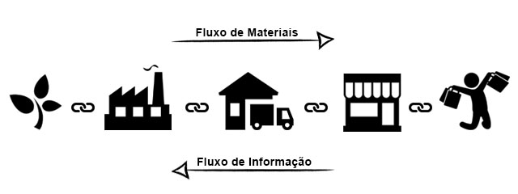
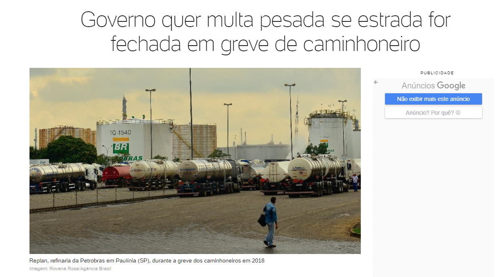

```{r child = "setup.Rmd"}
```

```{r xaringan-tile-view, echo=FALSE}
xaringanExtra::use_tile_view()
```

```{r xaringan-editable, echo=FALSE}
xaringanExtra::use_editable(expires = 1)
```

```{r xaringan-panelset, echo=FALSE, message=FALSE, warning=FALSE}
xaringanExtra::use_panelset()
xaringanExtra::style_panelset_tabs(panel_tab_font_family = "sans-serif")
```

```{r xaringanExtra-clipboard, echo=FALSE}
htmltools::tagList(
  xaringanExtra::use_clipboard(
    button_text = "<i class=\"fa fa-clipboard\"></i>",
    success_text = "<i class=\"fa fa-check\" style=\"color: #90BE6D\"></i>",
    error_text = "<i class=\"fa fa-times-circle\" style=\"color: #F94144\"></i>"
  ),
  rmarkdown::html_dependency_font_awesome()
)
```

```{r xaringan-fit-screen, echo=FALSE}
xaringanExtra::use_fit_screen()
```

```{r xaringan-extra-styles, echo=FALSE}
xaringanExtra::use_extra_styles(
  hover_code_line = TRUE,         #<<
  mute_unhighlighted_code = TRUE  #<<
)
```

```{css include=FALSE}
.panelset {
   --panel-tab-foreground: currentColor;
   --panel-tab-background: unset;
   --panel-tab-active-foreground: currentColor;
   --panel-tab-active-background: unset;
   --panel-tab-active-border-color: currentColor;
   --panel-tab-hover-foreground: currentColor;
   --panel-tab-hover-background: unset;
   --panel-tab-hover-border-color: currentColor;
   --panel-tab-inactive-opacity: 0.5;
   --panel-tabs-border-bottom: #ddd;
   --panel-tab-font-family: Sen;
   --panel-tab-background-color-active: #fffbe0;
   --panel-tab-border-color-active: #023d4d;
}

.panelset .panel-tabs .panel-tab > a {
	color: #023d4d;
}

.panelset .panel-tabs {
  font-size: 0.5rem;
}
```

## Grupos de trabalho?
.center[
.large[
.pink[ Enviar para mim até dia 22/01.]
]
]

---
class: center, middle

## Retrospecto

---

## Definições de Logística

Penso que o logística é muito mais um conjunto de princípios do que uma operação. "Fazer" `logística` relaciona-se à **promover o acesso a bens de consumo  e serviços, essenciais à vida humana e promovidos pelo consumo, destinados ao consumidor final da maneira mais eficiente e responsiva possível**. 

.question[
“**Logística** é dispor a **mercadoria ou o serviço** certo, no **lugar** certo, no **tempo** certo e nas **condições desejadas**, ao mesmo tempo em que fornece a **maior contribuição à empresa**”. 
(Ballou, 2001)
]
---
```{r echo=FALSE, message=FALSE, warning=FALSE, out.width="95%"}
knitr::include_graphics("./img/log5.png")
```

---

class: center, middle

## FORD saindo do Brasil

---

class: center, middle

<iframe width="894" height="503" src="https://www.youtube.com/embed/Il0frfdhPbg" frameborder="0" allow="accelerometer; autoplay; clipboard-write; encrypted-media; gyroscope; picture-in-picture" allowfullscreen></iframe>

---

## Operações logísticas

As operações que envolvem esses princípios apresentam-se em diferentes dimensões, contextos e níveis de integração. Estão fundamentalmente relacionadas a um **posicionamento estratégico de fluxos e entregas** necessários para que seja possível deixar o **consumidor feliz** e garantir a **competitividade das empresas**. Esse é o objetivo finalístico das operações logísticas. Não existe otimização dessas operações, mas sim, a busca de um `TRADE-OFF` entre `nível de serviço` e `custo.` 

---

## Operações logísticas

A implementação da Logística no contexto empresarial passou por diferentes etapas, desde uma atuação fragmentada das operações até a integração estratégica da cadeia produtiva. Quando há plena integração quanto ao processo de decisão em relação à `ENTREGA`, a estrutura consolidada é denominada `Cadeia de Suprimentos`. 

```{r echo=FALSE, message=FALSE, warning=FALSE, out.width="40%"}

```

---
class: center, middle

<iframe width="894" height="503" src="https://www.youtube.com/embed/5Ky98pI3FBQ" frameborder="0" allow="accelerometer; autoplay; clipboard-write; encrypted-media; gyroscope; picture-in-picture" allowfullscreen></iframe>

---

## Definição CLÁSSICA de cadeia de suprimentos

.tip[
A cadeia de suprimentos é a integração dos processos industriais e comerciais, partindo dos fornecedores iniciais até o consumidor final, gerando produtos, serviços e informações que agreguem valor para o cliente, maximizando a lucratividade total.
]

```{r echo=FALSE, message=FALSE, warning=FALSE}

```

---

## Gestão Cadeia de Suprimentos

.question[
.large[
**Cadeia de suprimentos** é a estrutura consolidada e integrada, em níveis estratégico, tático e operacional, entre agentes de produção, mercadológicos, logísticos e sociedade, para que seja possível coordenar as operações de maneira a garantir a gestão orientada à logística, tendo como objetivo o _trade-off_ entre **responsividade** e **eficiência**, além de garantia de um contexto sustentável de desenvolvimento por ações **socialmente responsáveis** e **resilientes.** 
]
]

.large[
.center[
**LINDO! DEFINIÇÃO DA RENATA.**
]
]


---

## Desafios contemporâneos
Desafios contemporâneos permeiam as decisões logísticas ao longo da cadeia de suprimentos. Ao longo deste curso, vamos explorar esses desafios e a expectativa de mudanças estruturais: conceituais e práticas.

---

## Alguns desafios da/para Logística 4.0:

.panelset[

.panel[.panel-name[Será???]

- **redução nos volumes de estoque de matéria-prima** ao longo da cadeia de suprimentos e o desenvolvimento de **fornecedores** aptos ao atendimento de pedidos seguindo as necessidades reais do negócio;
- pela **diminuição dos custos com perda de ativos e com transportes**;
- pela transformação da organização dos processos de **estocagem e armazenagem**;
]

.panel[.panel-name[Não pode ser!!!]

- por **integrar e compartilhar dados** mediante plataformas abertas;
- por **desburocratizar processos** e **obter diferenciais competitivos**;
- por **aumentar os níveis de segurança** do sistema;
- pela **identificação de problemas**, permitindo a adoção rápida e prática de soluções pertinentes;
- por proporcionar o **fluxo de informações, serviços e produtos.**

]

.panel[.panel-name[Vamos conseguir?]

- **digitalização**
- **virtualização dos processos**
- **conectividade** e **visibilidade** (visão)
- **transparência de processos e atuação** (entendimento)
- **capacidade preditiva** (estar preparado) e 
- **adaptabilidade** ao sistema (otimização).
]
]

[Fonte](https://www.grupotpc.com/blog/logistica-4-0/) 

.center[
**RESILIÊNCIA? RESPONSABILIDADE? BEM ESTAR?**
]

---

"O CEO da Cargo X, Federico Vega, conta que todo o processo é conduzido de forma **online**, desde a **contratação** ao **monitoramento** dos fretes. “O uso de **machine learning** aliado ao nosso **Big Data**, que possui informações de **rotas** e mais de **200 mil caminhoneiros cadastrados**, possibilita que tenhamos **ganhos significativos de eficiência** e **confiabilidade** para gerar o **match** entre **oferta** e **demanda**”, afirma. (...)

Segundo Federico, atualmente, a Cargo X opera mais de **6 mil fretes por mês** com um **time de menos 150 pessoas** dedicados a operação. “**Não possuímos um único caminhão próprio**, fato impossível de se realizar sem o uso de tecnologia”, destaca o executivo.

No último trimestre, a **taxa de sinistro da empresa** foi **menor que 2%**, o que Federico atribui ao rigoroso processo de **gestão de risco** e **monitoramento 100% online**."

[Fonte](https://noticias.gs1br.org/logistica-4-0-tendencias-e-desafios-para-melhorar-a-eficiencia/)

---

```{r echo=FALSE, message=FALSE, warning=FALSE}
knitr::include_graphics("./img/greve2018.png")
```

---

```{r echo=FALSE, message=FALSE, warning=FALSE}
knitr::include_graphics("./img/greve2018b.png")
```
---

```{r echo=FALSE, message=FALSE, warning=FALSE}
knitr::include_graphics("./img/greve2018c.png")
```
---

```{r echo=FALSE, message=FALSE, warning=FALSE, out.width="120%"}

```


---

```{r echo=FALSE, message=FALSE, warning=FALSE, out.width="120%"}
knitr::include_graphics("./img/vac2.png")
```

---

```{r echo=FALSE, message=FALSE, warning=FALSE, out.width="120%"}
knitr::include_graphics("./img/vac1.png")
```

---

class: center

## Atividades da semana

.larger[**Será enviada até sábado!**]

---

class: center, middle

.larger[
**DÚVIDAS?**
]
